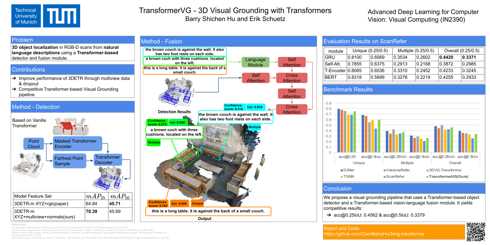

# TransformerVG: 3D Visual Grounding with Transformers

This repository is for the TransformerVG research project and 9th method on ScanRefer benchmark [paper].

<p align="center"></p>

## Introduction
In this project we perform the task of 3D visual grounding using an architecture that utilizes transformers. Existing approaches to this problem use an object detection module based on VoteNet and a fusion module, that fuses language features with the detected object features to predictthe final confidence scores. We propose TransformerVG, a transformer-based visual grounding pipeline that combines the 3DETR object detector with the transformer-based fusion model from the 3DVG pipeline. Through extensive experiments, we outperform the ScanRefer baseline in the Acc@50 metric by 6%, and achieved competitive results on the Benchmark. [**Link to the technical report**](https://github.com/ChenBarryHu/TransformerVG/blob/master/docs/TransformerVG_3D_Visual_Grounding_with_Transformer.pdf) 


## News
2022-01-29 We achieve 9th place in ScanRefer leaderboard :fire: :fire: :fire:


## Dataset

If you would like to access to the ScanRefer dataset, please fill out [this form](https://forms.gle/aLtzXN12DsYDMSXX6). Once your request is accepted, you will receive an email with the download link.

> Note: In addition to language annotations in ScanRefer dataset, you also need to access the original ScanNet dataset. Please refer to the [ScanNet Instructions](data/scannet/README.md) for more details.

Download the dataset by simply executing the wget command:
```shell
wget <download_link>
```

### Data format
```
"scene_id": [ScanNet scene id, e.g. "scene0000_00"],
"object_id": [ScanNet object id (corresponds to "objectId" in ScanNet aggregation file), e.g. "34"],
"object_name": [ScanNet object name (corresponds to "label" in ScanNet aggregation file), e.g. "coffee_table"],
"ann_id": [description id, e.g. "1"],
"description": [...],
"token": [a list of tokens from the tokenized description] 
```

## Setup
Our code is tested with PyTorch 1.10.0, CUDA 11.3.1 and Python 3.7. It may work with other versions.
Please execute the following command to install PyTorch

```shell
conda install pytorch==1.10.0 torchvision==0.11.1 cudatoolkit=11.3.1 -c pytorch
```

Install the necessary packages listed out in `requirements.txt`:
```shell
pip install -r requirements.txt
```
After all packages are properly installed, please run the following commands to compile the CUDA modules for the PointNet++ backbone:
```shell
cd lib/pointnet2
python setup.py install
```
__Optionally__, you can install a Cythonized implementation of gIOU for faster training.
```shell
conda install cython
cd _3detr/utils && python cython_compile.py build_ext --inplace
```
__Before moving on to the next step, please don't forget to set the project root path to the `CONF.PATH.BASE` in `lib/config.py`.__

### Data preparation
1. Download the ScanRefer dataset and unzip it under `data/`. 
2. Download the preprocessed [GLoVE embeddings (~990MB)](http://kaldir.vc.in.tum.de/glove.p) and put them under `data/`.
3. Download the ScanNetV2 dataset and put (or link) `scans/` under (or to) `data/scannet/scans/` (Please follow the [ScanNet Instructions](data/scannet/README.md) for downloading the ScanNet dataset).
> After this step, there should be folders containing the ScanNet scene data under the `data/scannet/scans/` with names like `scene0000_00`
4. Pre-process ScanNet data. A folder named `scannet_data/` will be generated under `data/scannet/` after running the following command. Roughly 3.8GB free space is needed for this step:
```shell
cd data/scannet/
python batch_load_scannet_data.py
```
> After this step, you can check if the processed scene data is valid by running:
> ```shell
> python visualize.py --scene_id scene0000_00
> ```
<!-- 5. (Optional) Download the preprocessed [multiview features (~36GB)](http://kaldir.vc.in.tum.de/enet_feats.hdf5) and put it under `data/scannet/scannet_data/`. -->
5. Pre-process the multiview features from ENet. 

    a. Download [the ENet pretrained weights (1.4MB)](http://kaldir.vc.in.tum.de/ScanRefer/scannetv2_enet.pth) and put it under `data/`
    
    b. Download and decompress [the extracted ScanNet frames (~13GB)](http://kaldir.vc.in.tum.de/3dsis/scannet_train_images.zip).

    c. Change the data paths in `config.py` marked with __TODO__ accordingly.

    d. Extract the ENet features:
    ```shell
    python scripts/compute_multiview_features.py
    ```

    e. Project ENet features from ScanNet frames to point clouds; you need ~36GB to store the generated HDF5 database:
    ```shell
    python scripts/project_multiview_features.py --maxpool
    ```
    > You can check if the projections make sense by projecting the semantic labels from image to the target point cloud by:
    > ```shell
    > python scripts/project_multiview_labels.py --scene_id scene0000_00 --maxpool
    > ```

## Usage
### Training
To train the TransformerVG model with XYZ+Multiview+Normals+Height values:
```shell
python scripts/train.py --use_multiview --use_height --use_normal --use_att_mask --dataset_num_workers <dataset_num_workers> --batch_size <batch_size>
```

### Evaluation
To evaluate the trained TransformerVG models, please find the folder under `outputs/` with the current timestamp and run:
```shell
python scripts/eval.py --folder <folder_name> --reference --use_multiview --use_height --use_normal --no_nms --force --repeat 5 --dataset_num_workers <value for dataset_num_workers> --batch_size <value for batch size>
```
Note that the flags must match the ones set before training. The training information is stored in `outputs/<folder_name>/info.json`

### Visualization
To predict the localization results predicted by the trained ScanRefer model in a specific scene, please find the corresponding folder under `outputs/` with the current timestamp and run:
```shell
python scripts/visualize.py --folder <folder_name> --scene_id <scene_id> --use_multiview --use_height --use_normal --dataset_num_workers <dataset_num_workers> --batch_size <batch_size> --use_train
```
Note that the flags must match the ones set before training. The training information is stored in `outputs/<folder_name>/info.json`. The output `.ply` files will be stored under `outputs/<folder_name>/vis/<scene_id>/`

### Pretrained Weights
For reproducing our results in the paper, we provide the following training commands and the corresponding pre-trained models:
1. Download the **[weight](https://drive.google.com/file/d/1VMng8hs0oaYNXK7aejWh6oB6hn2EZWuO/view?usp=sharing)** and extract the zip file under the **outputs** folder in your directory.

2. Execute the following command:
```shell
python scripts/train.py --lang_type gru --use_multiview --use_height --use_normal --dataset_num_workers <dataset_num_workers> --batch_size <batch_size> --use_att_mask --use_pretrained l20_old_dataset_logic
```
## Changelog

01/29/2022: Released the TransformerVG.


## Acknowledgement
This work is a research project conducted by Erik Schütz and Shichen Hu for ADL4CV:Visual Computing course at the Technical University of Munich.

We acknowledge that our work is based on ScanRefer, 3DETR and 3DVG-Transformer:

https://github.com/daveredrum/ScanRefer
https://github.com/facebookresearch/3detr
https://openaccess.thecvf.com/content/ICCV2021/papers/Zhao_3DVG-Transformer_Relation_Modeling_for_Visual_Grounding_on_Point_Clouds_ICCV_2021_paper.pdf 

